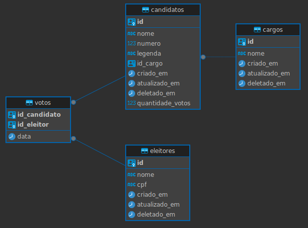

# Voting System

O projeto *Voting System* é uma API desenvolvida para o desafio da *Lifters*, onde o seu objetivo é disponibilizar
uma plataforma online de votação eletrônica. Através desta API, é possível cadastrar eleitores e candidatos, permitindo
que os eleitores votem nos candidatos disponíveis no sistema. Ao final da votação, é possível gerar o relatório dos candidatos e,
o sistema automáticamente irá verificar os candidatos mais votados e então irá retornar os dados dos vencedores da votação.

## 📖 Índice

- [Tecnologias utilizadas](#-tecnologias-utilizadas)
- [Funcionalidades desenvolvidas](#-funcionalidades-desenvolvidas)
- [Pré-requisitos](#-pré-requisitos)
- [Executando a API](#-executando-a-api)
  - [Passo 1: Clonar o repositório](#passo-1-clonar-o-repositório)
  - [Passo 2: Gerando .jar do projeto](#passo-2-gerando-jar-do-projeto)
  - [Passo 3: Gerando imagem Docker do projeto](#passo-3-gerando-imagem-docker-do-projeto)
  - [Passo 4: Executar o projeto Voting System](#passo-4-executar-o-projeto-voting-system)
- [Testando a API com o Swagger](#-testando-a-api-com-o-swagger)
- [Estrutura do sistema](#-estrutura-do-sistema)
  - [Diagrama do sistema](#diagrama-do-sistema)
  - [Relacionamentos](#relacionamentos)
  - [Projeto e Issues criados para guiar o desenvolvimento do projeto](#projeto-e-issues-criados-para-guiar-o-desenvolvimento-do-projeto)

## 🛠️ Tecnologias utilizadas

- **Java 21 LTS (Long-Term Support)**
  - Linguagem de programação utilizada
- **Spring Framework**
  - Base do projeto
- **Spring Boot**
  - Facilita o gerenciamento de dependências
- **Spring WEB**
  - Entegra a camada WEB da aplicação, facilitando a criação de Controllers
- **Spring Data JPA**
  - Facilita a integração com Banco de Dados, auxiliando na comunicação e criação de consultas personalizadas
- **Spring Data Redis**
  - Usado para Cache na aplicação, deixando ela mais performática
- **Spring Bean Validation**
  - Auxilia na validação das bordas da API
- **PostgreSQL**
  - Banco de Dados relacional utilizado
- **Liquibase**
  - Gerenciador de migrações, auxilia no versionamento do Banco de Dados
- **Spring Doc OpenAPI**
  - Documentação da aplicação, provê uma interface WEB com os endpoints disponíveis
- **Docker**
  - Criação dos containers utilizados, facilita a configuração das ferramentas e facilita a implantação do sistema
- **Docker Compose**
  - Gerenciador de containers Docker, facilita a execução de vários containers necessários para o sistema

## 🚀 Funcionalidades desenvolvidas

- [x] CRUD de *Cargos* - Onde é possível Cadastrar, Buscar, Atualizar e Deletar um dado *Cargo*
- [x] CRUD de *Candidatos* - Onde é possível Cadastrar, Buscar, Atualizar e Deletar um dado *Candidato*
- [x] CRUD de *Eleitores* - Onde é possível Cadastrar, Buscar, Atualizar e Deletar um dado *Eleitore*


- [x] Voto do *Eleitor* - Funcionalidade que permite que um dado *Eleitor* vote em um dado *Candidato*
  - Restrições:
    - Cada *Eleitor* pode votar apenas **um vez** em um dado **Candidato**
    - Assim o *Candidato* não pode receber mais do que um voto de um dado _Eleitor_


- [x] Relatório da votação - Funcionalidade que permite consultar os vencedores da votação
  - É consultado no Banco de Dados quais *Candidatos* venceram as votações por *Cargo*
  - É gerada uma lista com os _Candidatos_ vencedores, informando o seu _Cargo_ e quantidade de votos que obtiveram na votação


- [x] A estrutura do Banco de Dados é versionado pelo _Liquibase_
- [x] O projeto usa _Cache Redis_ para aumentar a perfomance da aplicação
  - O _cache_ está sendo aplicado na geração do relatório e na listagem de _Candidatos_ e _Eleitores_

## 🛠️ Pré-requisitos

Antes de iniciar o sistema, verifique se você possui a seguinte ferramenta instalada em sua máquina:

- Docker
- Maven
- Git

Sim, precisamos de apenas essas ferramentas para exectar o sistema, pois com o Docker, podemos encapsular todo o nosso sistema
em containers e assim fazer com que eles se comuniquem e façam o sistema funcionar.

- Para instalar o *Docker* acesse: https://docs.docker.com/engine/install/
- Para instalar o *Maven* acesse: https://sdkman.io/install
  - ```sdk install maven``` Depois de instalar o *SDKMAN*
- Para instalar o *Git* acesse: https://git-scm.com/downloads

## 🚀 Executando a API

### Passo 1: Clonar o repositório

Comece clonando este repositório para sua máquina local. Abra o terminal e execute o seguinte comando:

```bash
git clone https://github.com/Rosivaldo-Lucas/voting-system-lifters.git
```

Isso criará uma cópia local do repositório em seu ambiente

### Passo 2: Gerando .jar do projeto

Navegue até o diretório raiz do projeto e execute os seguintes comando para gerar o *.jar* do projeto

```bash
cd nome-do-repositorio
```

```bash
mvn clean package
```

Este comando irá limpar e buildar o projeto e também irá gerar o *.jar* na pasta */target*

### Passo 3: Gerando imagem Docker do projeto

Na raiz da pasta do projeto, execute o seguinte comando para gerar a imagem Docker do projeto

```bash
docker image build -f Dockerfile -t desafio/app-vs:0.0.1 .
```

### Passo 4: Executar o projeto Voting System

Na raiz da pasta do projeto, execute o seguinte comando para iniciar os containers Docker necessários para inicializar o projeto

```bash
docker compose -f docker-compose.yml up -d
```

Este comando irá executar o container do Banco de Dados *PostgreSQL*, o container do Banco de Dados em memória *Redis* para Cache
e irá executar a aplicação *Spring Boot* na porta *8080*

## 📝 Testando a API com o Swagger

Com o sistema em execução, em seu navegador digite a seguinte URL para abrir a documentação da aplicação

[http://localhost:8080/swagger-ui/index.html](http://localhost:8080/swagger-ui/index.html)

## ⚙️ Estrutura do sistema

### Diagrama do sistema



### Relacionamentos

- Candidato está relacionado com um cargo e um cargo pode está relacionado com vários candidatos
- Candidato é votado por vários eleitores
- Eleitor vota em vários candidatos
- Voto contém todos os registros de voto de eleitor para dado candidato

### Projeto e Issues criados para guiar o desenvolvimento do projeto

- [Projeto](https://github.com/users/Rosivaldo-Lucas/projects/5/views/1)
- [Issues](https://github.com/Rosivaldo-Lucas/voting-system-lifters/issues?q=is%3Aissue+is%3Aclosed)
